# VCL-Lab2-REPORT
使用说明详见[课程网站](https://vcl.pku.edu.cn/course/vci/lab2)
```
// cd vcx2024
xmake
// for Visual Studio
xmake project -a x64 -k vsxmake ./build
// for Xcode
xmake project -k xcode ./build
// finally
xmake run lab0
```
[more details:](https://vcl.pku.edu.cn/course/vci/lab0)

## 参考：[@Kingsley-Yoimiya](https://github.com/Kingsley-Yoimiya)

### task1:Loop Mesh Subdivision
**思路：** 每次迭代，先把原有的点和面复制一份存储；<br>
1按权重将原有点更新：<br>
2新增边点：<br>
对于边界上，直接取边中点；
对于其他，按权重更新<br>
3面的建立：如图所示，依次添加下面这些面：(注意顺时针！）<br>
```
std::uint32_t toInsert[4][3] = {
    // your code here:
    v0,m2,m1,
    m0,m1,m2,
    v2,m1,m0,
    v1,m0,m2
};
```
**完成过程：**
1.这个task基本已经给出了框架，相当于是整个lab的引入，教我们怎么做。按照上面的思路一步一步填即可。<br>
2.开始没明白为什么要建立DCEL G，和为什么是先更新原有点（这样会改变边点啊）后来意识到是在新建的G上修改然后和原来的交换。<br>
**效果：** 均是iteration=2，3太密集了看不清<br>
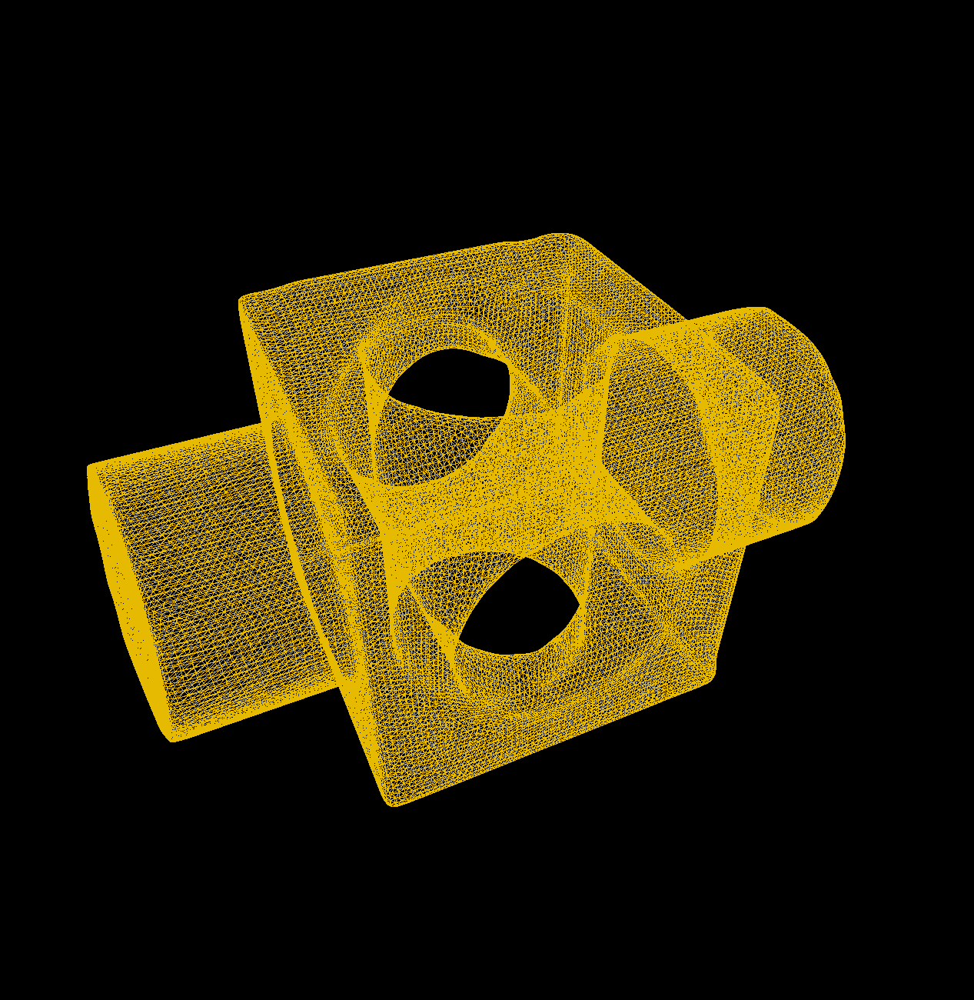
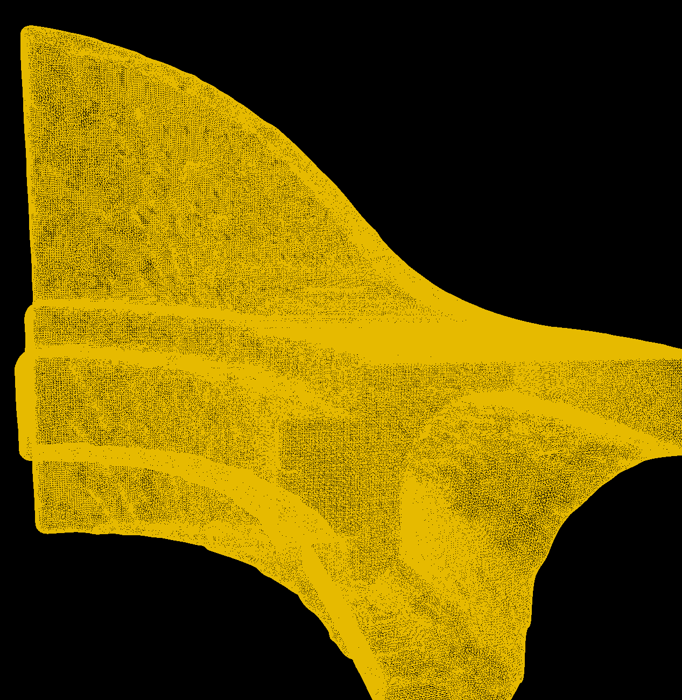

### task2:Spring-Mass Mesh Parameterization 
**思路：** <br>
1.将所有边界点选出，依次映射到圆边界上。因为边界点的索引不一定按顺时针或者逆时针方向，如果暴力对应到(k*2π/n)会导致边界上纹理扭曲，所以只能先直接取(x,y)坐标再以(0.5,0.5)为中心投射到圆周上，这样能保持边缘的纹理正常。<br>
2.然后进行迭代，实际上相当于是每次把内部点变为其邻居的平均。<br>
**完成过程：** <br>
1.我最开始没有多想直接把边界点按序号依次暴力对应到圆周、正方形上的n等分处。<br>
然后得到的纹理一直是扭曲的。我注意到脸的边界处纹理就是扭曲的，想到可能是边界点不对应（也即他们的索引不是按顺时针方向而是乱序的）。<br>
2.于是我尝试输出边界点的纹理，但是fail，因为原数据结构纹理这个属性是的空的。最后让输出坐标，尝试边界点u,v直接取x,y+0.5（落到[0,1]内）得到下面第二张图的纹理，已经很接近要求了。<br>
3.在此基础上继续把边界按(0.5,0.5)中心投影到圆周(x-0.5)^2+(y-0.5)^2=0.5^2上。这样使得原纹理更加舒展<br>
4.有意思的：虽然原题要求最后u,v在[0,1]内，但是如果我们把u,v全部乘4得到一个更细密的纹理，如下面第三张图。<br>
图1（最终成果）	<br>
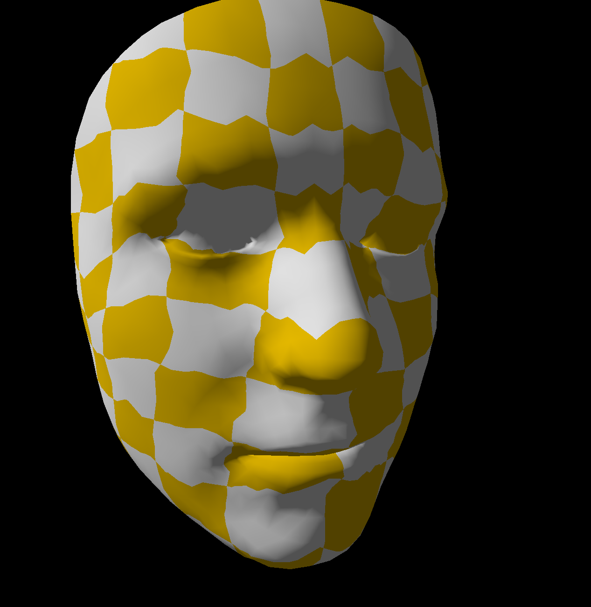
图2（直接取x,y未化为圆边界）<br>
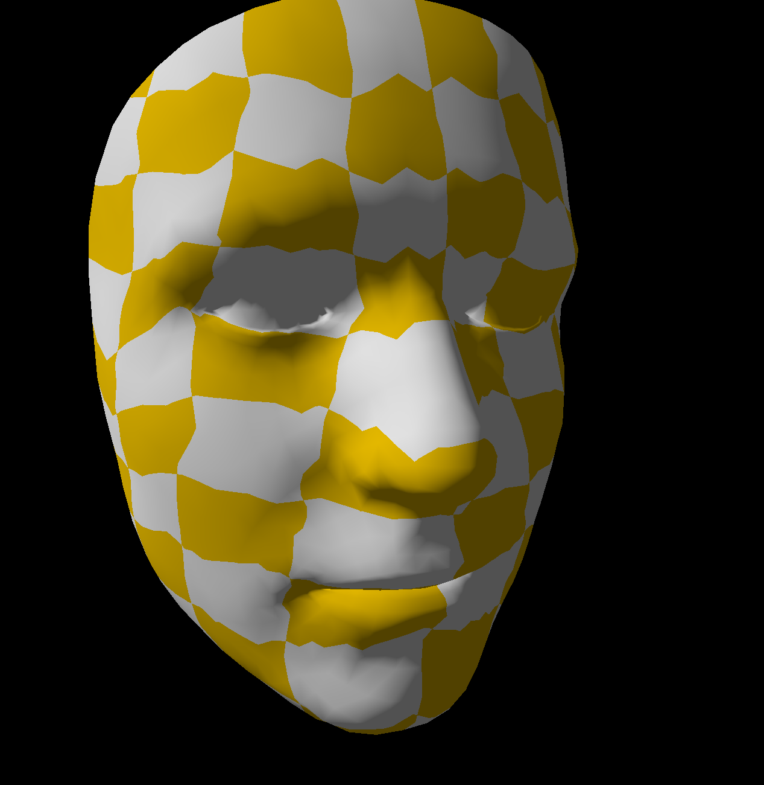
图3（u,v更大）<br>
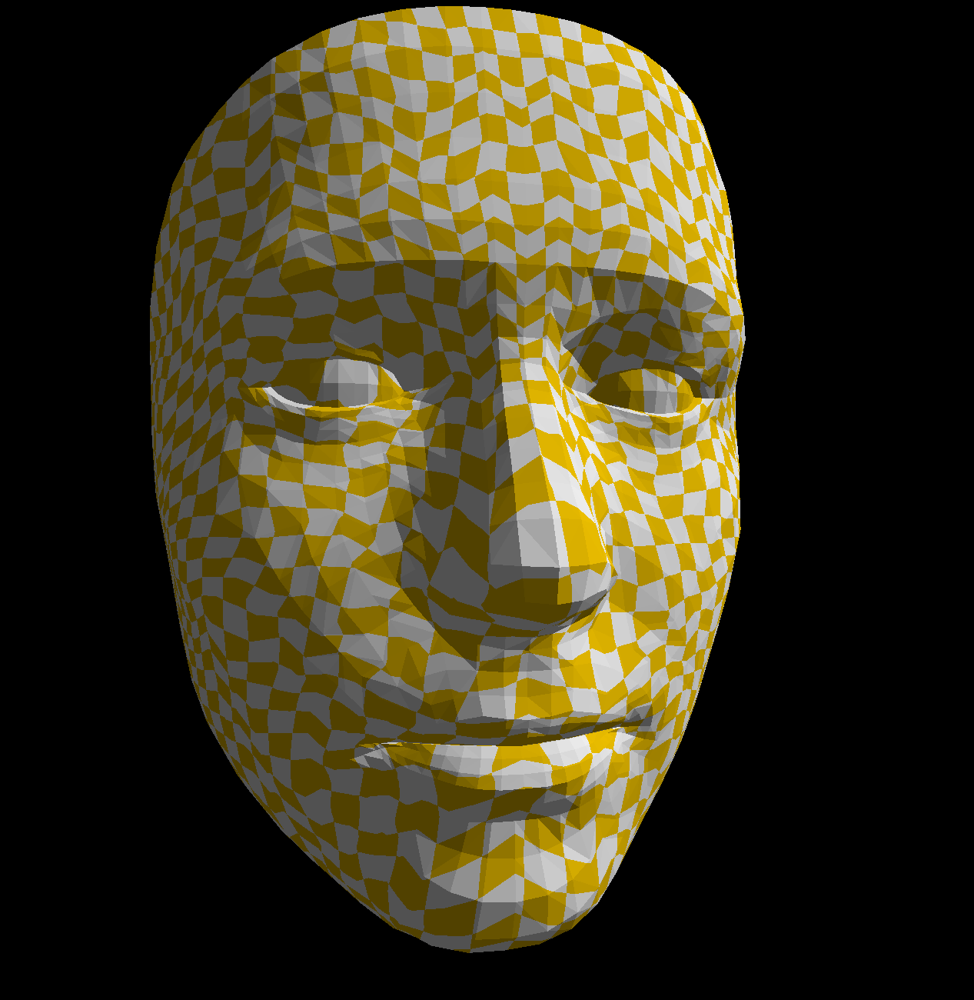

### task3:Mesh Simplification
**思路：** 先读懂论文明确步骤。这个task步骤比较多而且乱，按照引导一步步写。<br>
1.首先是计算面的Kp矩阵。这里我用叉积求法向量再与任一点相乘得到d即可<br>
2.对于v1,v2,Q按照论文里公式先把Q第四行变成(0,0,01)再v=Q1^-1*(0,0,01)<br>
cost=dot(v,Q1*v。)注意不可逆的情况直接v取中点。<br>
3.对于v周围的ring内的点更新Q矩阵：用新计算的减去旧计算的，把差值加上即可。v自己的Q矩阵由周围face之和。<br>
4.最后对于所有牵涉到ring上点的边，更新pair：对于ring 上点v1,遍历其ring的边e，注意到e1=e-nextedge是指向v1的，由此更新e1所在的pair即可。<br>
**完成过程：**
按照上面的思路写。bug：比如球没有被删除任何点，后面的模型也报错终止等。我尝试了很多次输出点数量，输出最后一次报错点的邻居甚至到IsContractable函数等找错误。<br>
最后主要有四个bug:<br>
1.首先是glm库的特性，它是先列再行（与列向量矩阵乘法有关），和我们平常不同。我在打印了Q之后才发现的。<br>
2.如果行列式绝对值小于1e-3就认为不可逆，返回中点。去最开始写的直接返回空edge，于是球形不能化简了。<br>
3.最后一步更新的时候没有去改原位置的targetposition和cost，而是新push_back pair导致相当于没改pair。<br>
4.开始用一个大小为32768的数组储存哪些节点被v的改变影响到了，后面去针对地更新pair。这样速度慢而且容易空间不够报错。但实际上只有v周围那一圈的点，用几次ring加上巧妙的判断就可以了。<br>
总之这个task是最后一个做的，也花了最长时间。<br>
**感谢@Kingsley-Yoimiya,没有他的帮助，我很难发现自己哪写错了（上面的3.是一个致命错误）** <br>

效果图：（均是在最高简化等级下）<br>
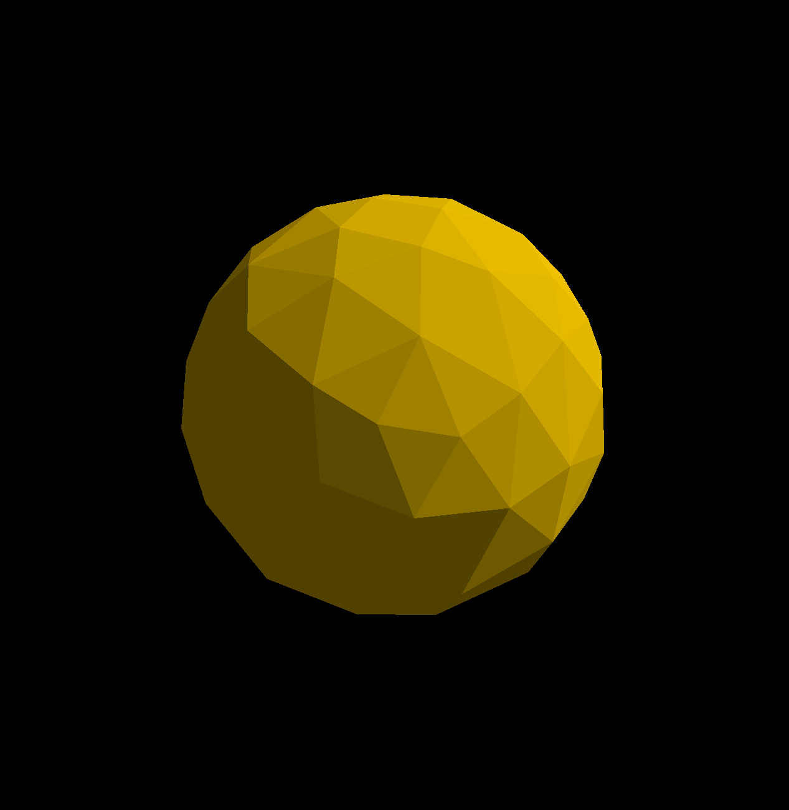
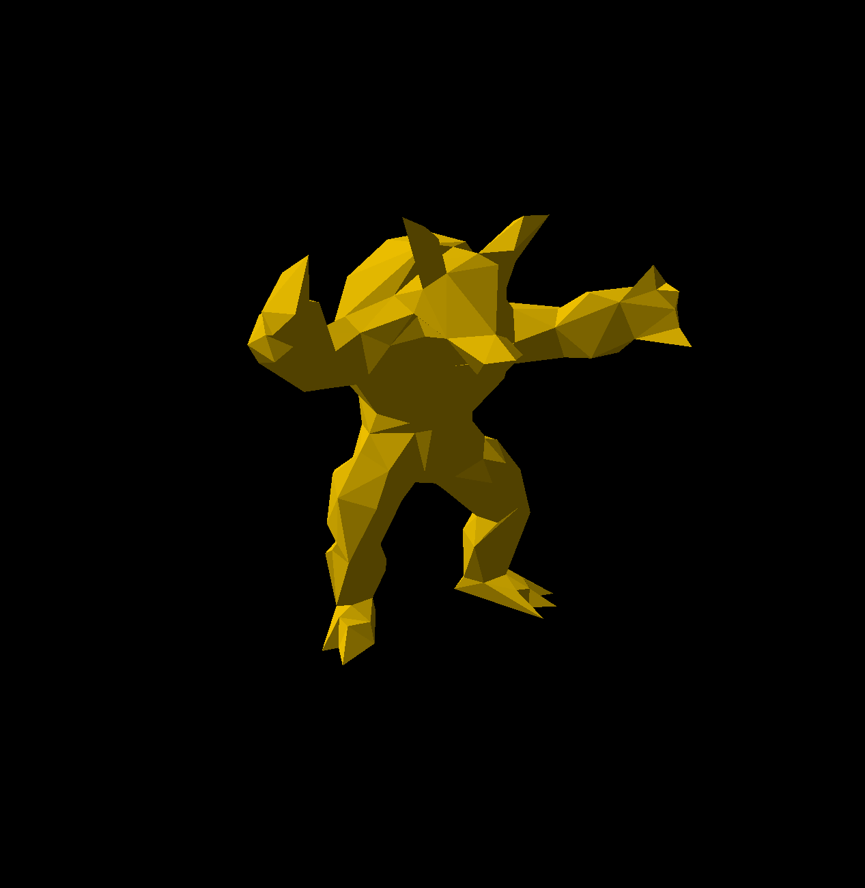
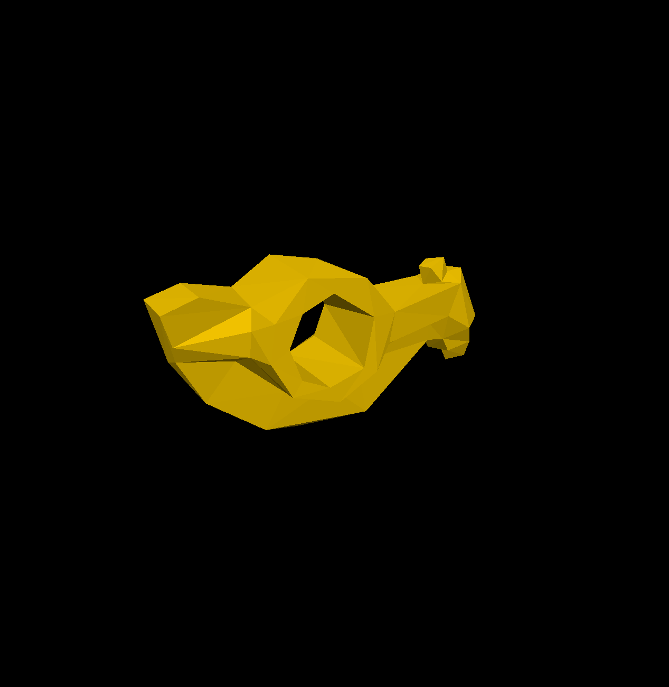

### task4:Mesh Smoothing
`思路：`
1.先写一个余切函数。我用点积与叉积的商得到。<br>
并令其小于一个阈值（我最后取了0.5）时取到该阈值<br>
2.在每个点邻居处使用余切拉普拉斯权重。只需要遍历两个点分别的邻居，找出共同邻居即可。注意一共恰好是两个共同邻居。分别点加权、除以权重和。<br>
权重和小于1e-9时相当于0，保险起见直接取原来的点。<br>
`完成过程：`
均值则会消去棱角变得光滑，而余切拉普拉斯容易保留原模型中的棱角，。这使得block中容易把两侧的圆台误认为是棱角最终变成有小型突刺。我尝试了多种方法：<br>
1.完全不设阈值（不处理）未报错也没有明显变化。<br>
2.负余切变为正，效果不显著。<br>
3.更大的阈值。正如最后取的0.5一样，差不多是起到了光滑一点的效果。但是同时也保留了棱角等特征（即使在迭代10次之后仍然有小恐龙的三个爪子）比较满意<br>
4.尝试在两个余切相加时特判接近0的不要。结果更加尖锐了。<br>
总结：我其实认为当余切值为0或者负数时代表邻居距离较远，重要性下降，将其削为一个比较小的阈值应该是正解。（上面的3.）但是结果貌似不好。<br>
另外其实将阈值过分提高（0.5）也不应该，因为这削弱了很多节点的正常邻居的连接。但是从结果上看还是选择了这个。（也许这就是炼丹吧）<br>

效果：<br>
1.均值拉普拉斯	<br>		
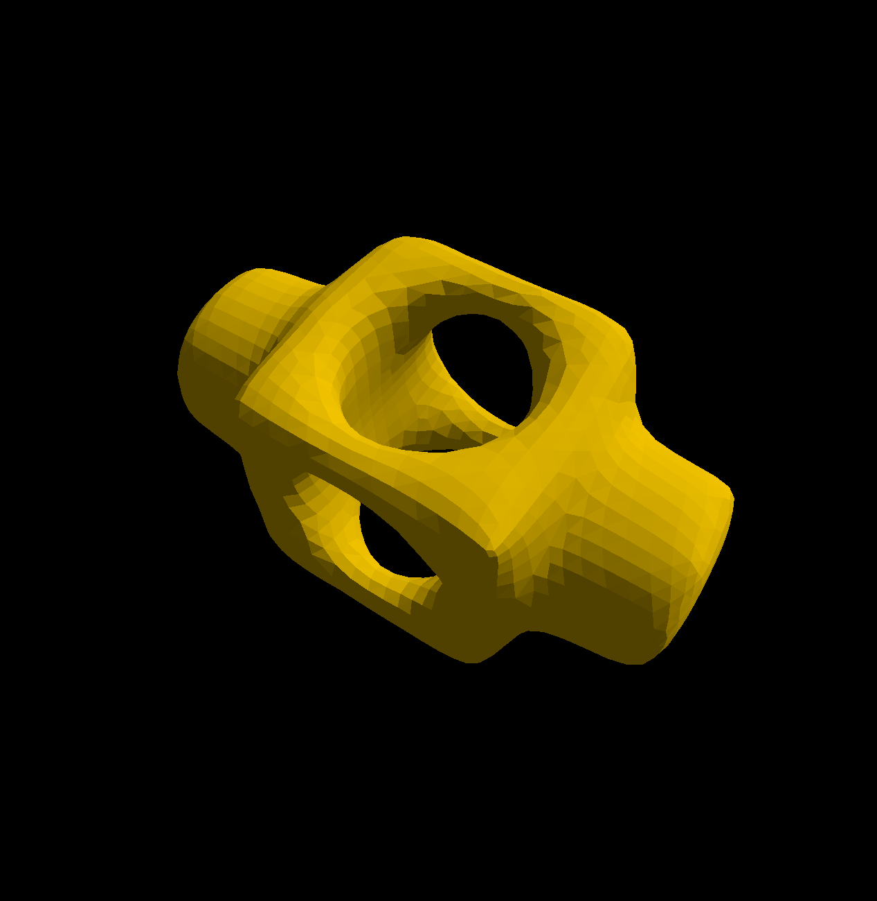
2.余切拉普拉斯<br>
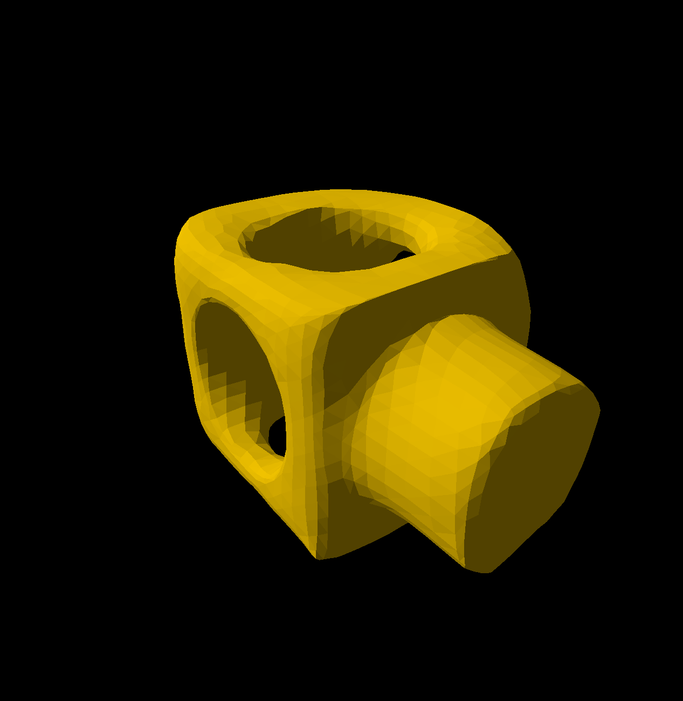
3.余切拉普拉斯（正常阈值1e-2）<br>
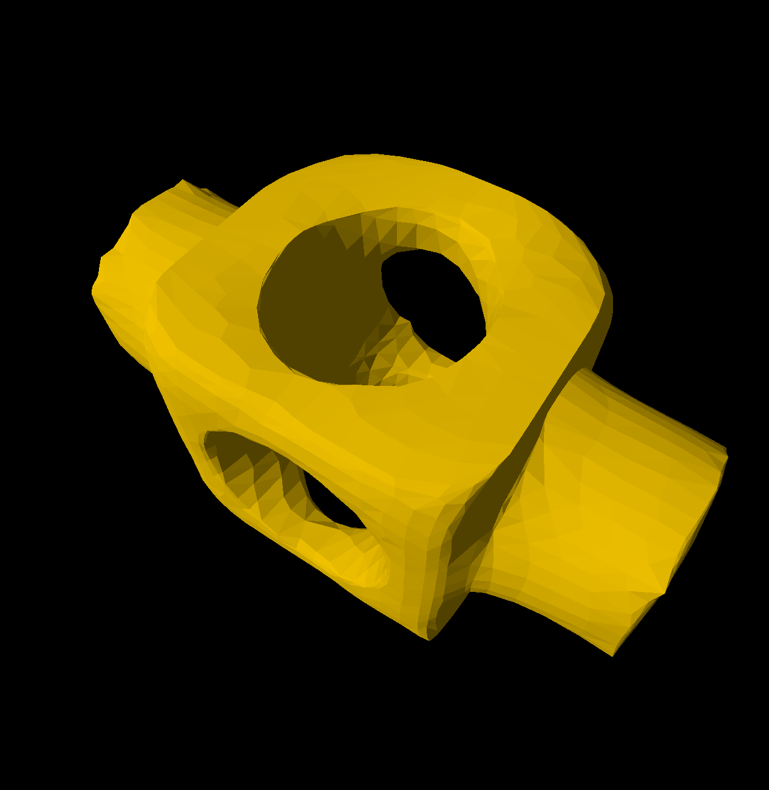
4.余切拉普拉斯<br>		
可以即使迭代10次之后看到左边仍然保留了爪子和脚爪的形状特征<br>
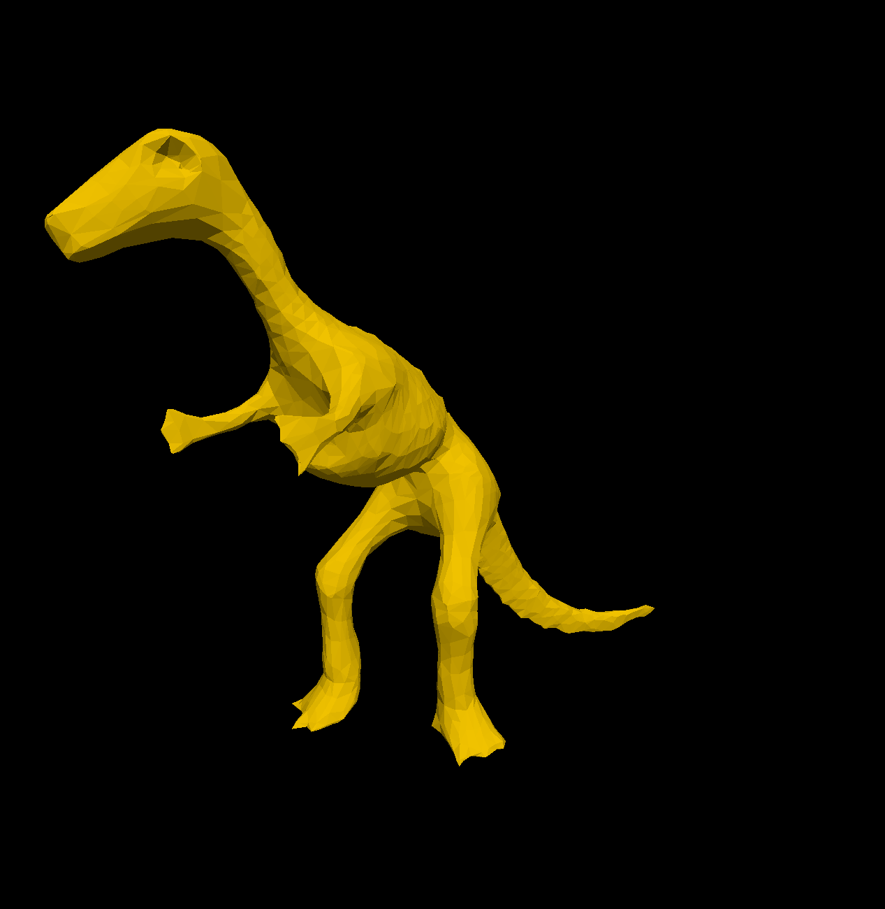
5.均匀拉普拉斯<br>
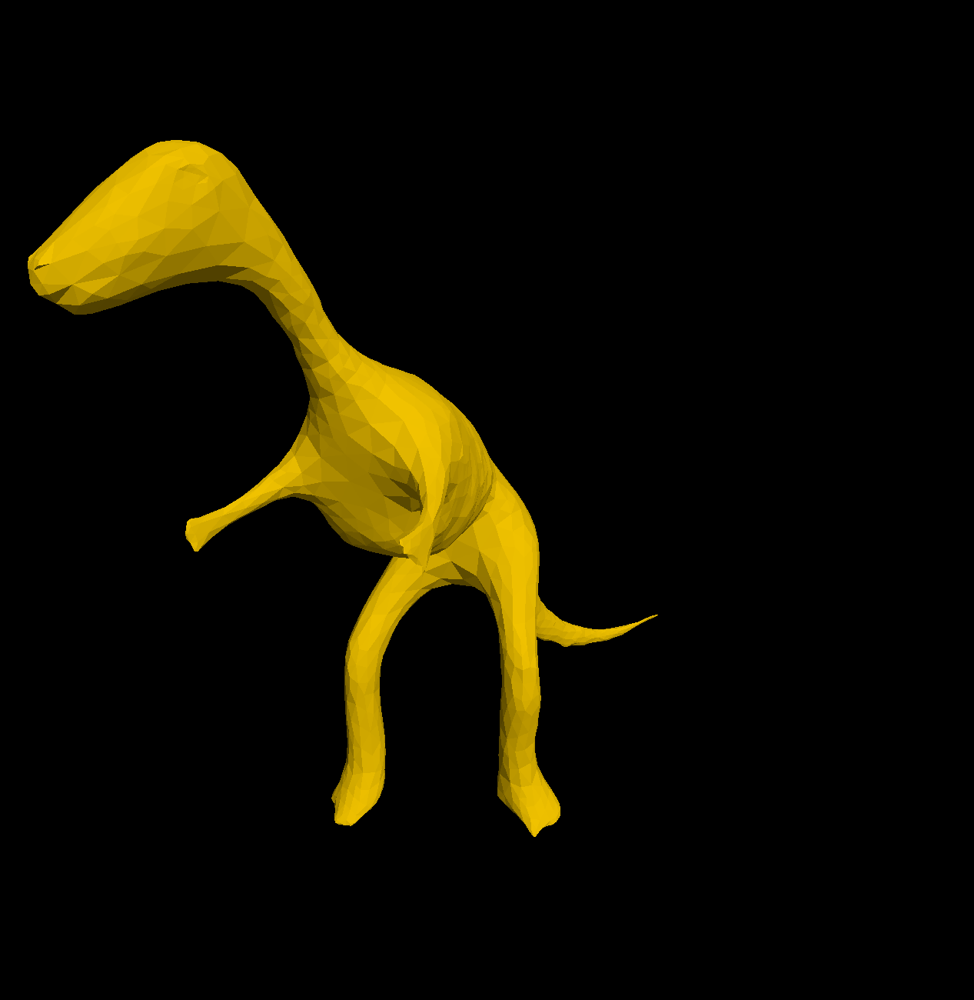

### task5:Marching cubes
`思路:`1.先遍历n*n*n的正方体框架，计算出其中哪些边上有点；<br>
2.对于一个正方体单位格，已知其八个顶点的状态(v)，用两个表格<br>
c_EdgeStateTable 和 c_EdgeOrdsTable和巧妙的算式计算出哪些三角形（边）和对应点需要push进去，以及按照对应顺序。<br>
我这里觉得指导里那个算式不太喜欢，于是自己造了一张表来选出对应边。<br>
```
float edgeTable[12][3] = {
    {d[0] / (d[0] - d[1]),   0,   0},
    {d[2] / (d[2] - d[3]),   1,   0},
    {d[4] / (d[4] - d[5]),   0,   1},
    {d[6] / (d[6] - d[7]),   1,   1},
    {  0, d[0] / (d[0] - d[2]),   0},
    {  0, d[4] / (d[4] - d[6]),   1},
    {  1, d[1] / (d[1] - d[3]),   0},
    {  1, d[5] / (d[5] - d[7]),   1},
    {  0,   0, d[0] / (d[0] - d[4])},
    {  1,   0, d[1] / (d[1] - d[5])},
    {  0,   1, d[2] / (d[2] - d[6])},
    {  1,   1, d[3] / (d[3] - d[7])}
};
```
3.最开始没注意差值，那张表直接用的边中点（0.5）。最后修正为插值了。<br>
`完成过程：`
1.想想清楚步骤：遍历得到判断每条边是否被穿过；再把他们当做mesh的顶点，push节点与面。这里分别需要用到由8位bit（v）导出的边的表与面的表。<br>
2.我最开始无脑用大数组n*n*n*3储存边信息，碰到过两个bug：<br>
1）vs2022特色矢山不支持变长数组。我决心解决它，查阅资料下载好久并改成使用LLVM-clang工具集，结果xmake又给我变回去了。我再尝试修改xmake.lua的配置set_cc("clang-cl")set_cxx("clang-cl")也总是报错。因为搞不懂xmake原理最后只能放弃。<br>
2）最开始使用了两个数组，一个储存顶点是否在内部（sdf）另一个储存其右上方正方体的8位v值。空间开销太大。最后都优化到单次循环的操作过程中了。<br>
3.我嫌lab指导里那个公式“第 j 条边的起始点为 ：v0 + dx * (j & 1) * unit(((j >> 2) + 1) % 3) + dx * ((j >> 1) & 1) * unit(((j >> 2) + 2) % 3)”<br>
麻烦最后自己搞了一个EdgeTable表来对应mesh的顶点。<br>
4.完成这些时我想都没想就用的边中点。结果像minecraft一样方块状。我意识到这是需要插值，于是把EdgeTable改成插值形式，取两个顶点的sdf值分别作为权重衡量远近。这里还是花了点眼力去对照图建造的。<br>
5.最后Kingsley-Yoimiya认为我引以为豪这个表在工程上的是矢山，因为别人看不懂又要写注释（doge）<br>

如图：n=45的sphere:可以明显看出一圈一圈像同心圆的纹路，而且有三个不同方向。这应该是marching cubes 原正方体网格的边上点排列规律导致的（比如z方向的边x,y都是整数只有z有插值等）<br>
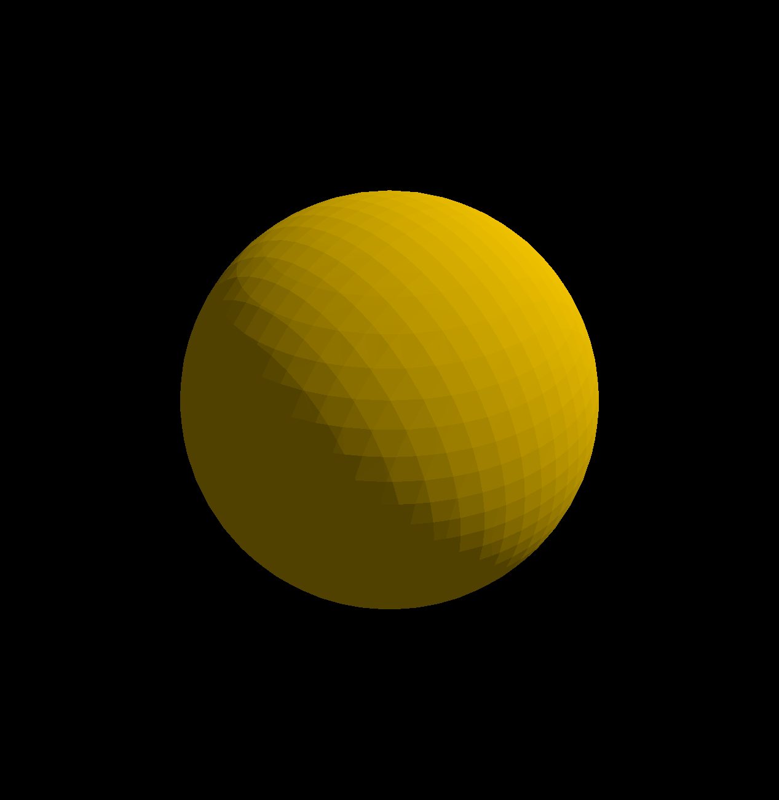
如图：n=100的环<br>
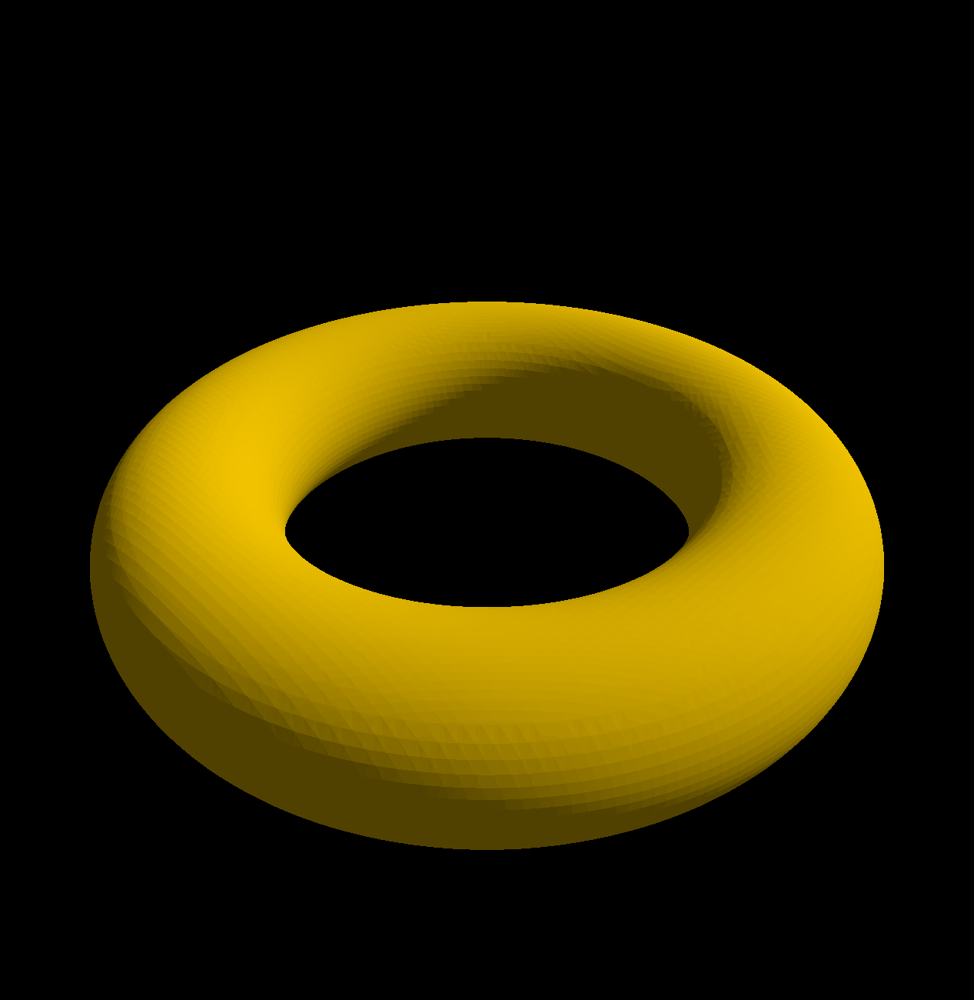
这个是最开始未插值的结果<br>
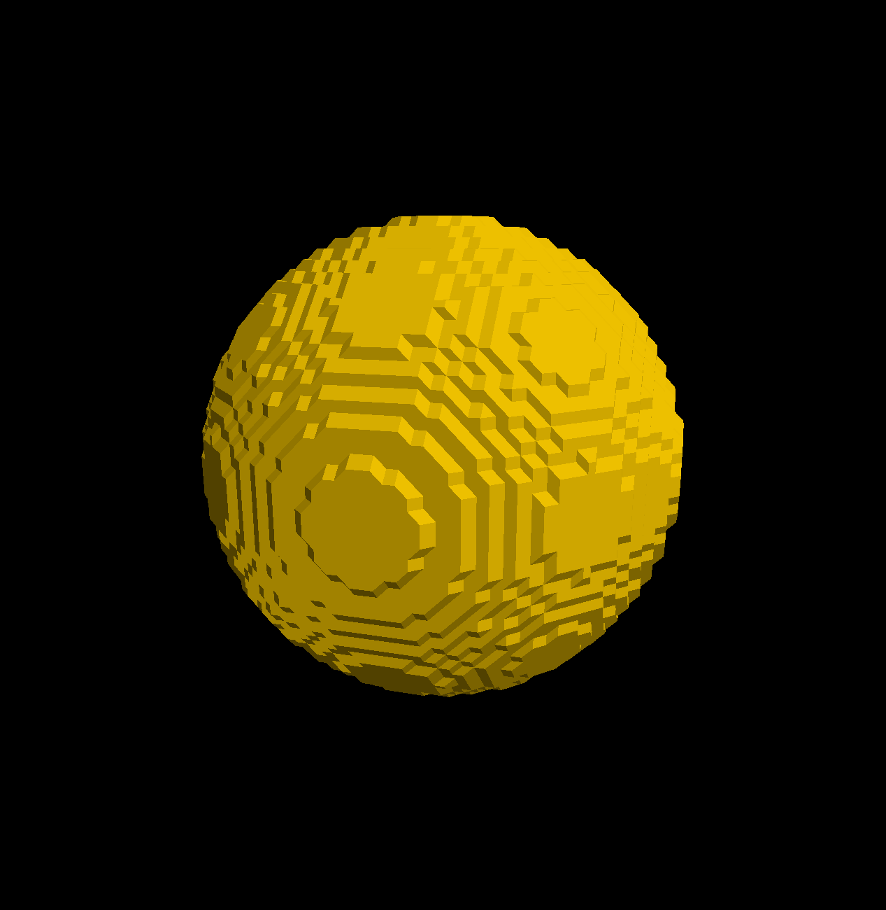
